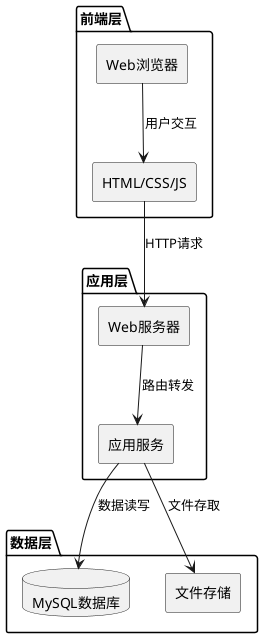

# 观影系统技术设计文档

## 1. 实现模型

### 1.1 上下文视图

本系统采用经典的三层架构模式，前后端分离设计：



### 1.2 服务/组件总体架构

系统分为以下核心组件：

**前端组件**
- **UI展示层**：基于Bootstrap 5的响应式界面
- **交互控制层**：JavaScript事件处理和DOM操作
- **数据渲染层**：动态电影卡片、列表渲染

**后端组件**
- **API网关层**：统一请求入口和路由分发
- **业务逻辑层**：核心业务处理
  - 电影服务（MovieService）
  - 用户服务（UserService）
  - 观影服务（WatchService）
  - 管理服务（AdminService）
- **数据访问层**：数据库操作封装

**基础设施**
- **数据库**：MySQL 8.0
- **缓存**：Redis（可选）
- **文件存储**：本地文件系统或云存储

### 1.3 实现设计文档

#### 1.3.1 技术栈选型

**前端技术栈**
- HTML5 + CSS3 + JavaScript (ES6+)
- Bootstrap 5.3.0（UI框架）
- Bootstrap Icons 1.10.3（图标库）
- 原生JavaScript（无框架依赖，保持轻量）

**后端技术栈**
- Node.js 18+（运行环境）
- Express.js 4.x（Web框架）
- MySQL 8.0（关系型数据库）
- Sequelize 6.x（ORM框架）
- JWT（身份认证）
- Bcrypt（密码加密）

**开发工具**
- Visual Studio Code（IDE）
- Git（版本控制）
- Postman（API测试）
- PM2（进程管理）

#### 1.3.2 项目目录结构

```
movie-watching-system/
├── frontend/                 # 前端代码
│   ├── index.html           # 首页
│   ├── css/
│   │   └── style.css        # 自定义样式
│   ├── js/
│   │   ├── app.js           # 主应用逻辑
│   │   ├── api.js           # API调用封装
│   │   └── utils.js         # 工具函数
│   └── assets/              # 静态资源
│       └── images/          # 图片资源
│
├── backend/                  # 后端代码
│   ├── src/
│   │   ├── app.js           # 应用入口
│   │   ├── config/          # 配置文件
│   │   │   ├── database.js  # 数据库配置
│   │   │   └── jwt.js       # JWT配置
│   │   ├── models/          # 数据模型
│   │   │   ├── Movie.js     # 电影模型
│   │   │   ├── User.js      # 用户模型
│   │   │   ├── Favorite.js  # 收藏模型
│   │   │   └── WatchRecord.js # 观影记录模型
│   │   ├── controllers/     # 控制器
│   │   │   ├── movieController.js
│   │   │   ├── userController.js
│   │   │   ├── watchController.js
│   │   │   └── adminController.js
│   │   ├── services/        # 业务服务
│   │   │   ├── movieService.js
│   │   │   ├── userService.js
│   │   │   ├── watchService.js
│   │   │   └── adminService.js
│   │   ├── routes/          # 路由
│   │   │   ├── movieRoutes.js
│   │   │   ├── userRoutes.js
│   │   │   ├── watchRoutes.js
│   │   │   └── adminRoutes.js
│   │   ├── middlewares/     # 中间件
│   │   │   ├── auth.js      # 认证中间件
│   │   │   ├── errorHandler.js # 错误处理
│   │   │   └── validator.js # 参数验证
│   │   └── utils/           # 工具函数
│   │       ├── logger.js    # 日志工具
│   │       └── response.js  # 响应格式化
│   ├── package.json         # 依赖配置
│   └── .env                 # 环境变量
│
├── database/                 # 数据库相关
│   ├── migrations/          # 迁移文件
│   ├── seeders/             # 种子数据
│   └── schema.sql           # 数据库结构
│
├── docs/                     # 文档
│   ├── api.md               # API文档
│   └── deployment.md        # 部署文档
│
└── .gitignore               # Git忽略配置
```

## 2. 接口设计

### 2.1 总体设计

**API设计原则**
- RESTful风格
- 统一响应格式
- JWT身份认证
- 错误码标准化

**响应格式**
```json
{
  "code": 200,
  "message": "success",
  "data": {}
}
```

**认证方式**
- 使用JWT Bearer Token
- Token放在请求头：`Authorization: Bearer <token>`
- Token有效期：7天

### 2.2 接口清单

#### 2.2.1 电影相关接口

**获取电影列表**
- **接口**：`GET /api/movies`
- **参数**：
  - `page`: 页码（默认1）
  - `limit`: 每页数量（默认20）
  - `genre`: 分类筛选（可选）
  - `keyword`: 搜索关键词（可选）
  - `sort`: 排序方式（默认update_time）
- **响应**：电影列表及分页信息

**获取电影详情**
- **接口**：`GET /api/movies/:id`
- **参数**：无
- **响应**：电影详细信息

**获取热门电影**
- **接口**：`GET /api/movies/hot`
- **参数**：
  - `limit`: 数量（默认10）
- **响应**：热门电影列表

**获取分类电影**
- **接口**：`GET /api/movies/genre/:genre`
- **参数**：
  - `page`: 页码
  - `limit`: 每页数量
- **响应**：指定分类的电影列表

#### 2.2.2 用户相关接口

**用户注册**
- **接口**：`POST /api/users/register`
- **参数**：
  - `username`: 用户名
  - `email`: 邮箱
  - `password`: 密码
- **响应**：注册成功信息

**用户登录**
- **接口**：`POST /api/users/login`
- **参数**：
  - `username`: 用户名或邮箱
  - `password`: 密码
- **响应**：JWT Token和用户信息

**获取用户信息**
- **接口**：`GET /api/users/profile`
- **认证**：需要
- **响应**：用户详细信息

**更新用户信息**
- **接口**：`PUT /api/users/profile`
- **认证**：需要
- **参数**：
  - `nickname`: 昵称
  - `avatar`: 头像URL
- **响应**：更新后的用户信息

#### 2.2.3 观影相关接口

**添加收藏**
- **接口**：`POST /api/watch/favorites`
- **认证**：需要
- **参数**：
  - `movieId`: 电影ID
- **响应**：收藏成功信息

**取消收藏**
- **接口**：`DELETE /api/watch/favorites/:id`
- **认证**：需要
- **响应**：取消成功信息

**获取收藏列表**
- **接口**：`GET /api/watch/favorites`
- **认证**：需要
- **参数**：
  - `page`: 页码
  - `limit`: 每页数量
- **响应**：收藏列表

**获取观影记录**
- **接口**：`GET /api/watch/records`
- **认证**：需要
- **参数**：
  - `page`: 页码
  - `limit`: 每页数量
- **响应**：观影记录列表

#### 2.2.4 管理相关接口

**添加电影**
- **接口**：`POST /api/admin/movies`
- **认证**：需要（管理员）
- **参数**：电影完整信息
- **响应**：添加成功信息

**更新电影**
- **接口**：`PUT /api/admin/movies/:id`
- **认证**：需要（管理员）
- **参数**：电影更新信息
- **响应**：更新成功信息

**删除电影**
- **接口**：`DELETE /api/admin/movies/:id`
- **认证**：需要（管理员）
- **响应**：删除成功信息

**获取用户列表**
- **接口**：`GET /api/admin/users`
- **认证**：需要（管理员）
- **参数**：
  - `page`: 页码
  - `limit`: 每页数量
- **响应**：用户列表

**获取统计数据**
- **接口**：`GET /api/admin/statistics`
- **认证**：需要（管理员）
- **响应**：系统统计数据

## 3. 数据模型

### 3.1 设计目标

- 规范化设计，减少数据冗余
- 合理的索引设计，优化查询性能
- 支持逻辑删除，保留历史数据
- 时间戳自动管理

### 3.2 模型实现

#### 3.2.1 电影表（movies）

```sql
CREATE TABLE movies (
    id INT PRIMARY KEY AUTO_INCREMENT COMMENT '电影ID',
    title VARCHAR(100) NOT NULL COMMENT '标题',
    poster VARCHAR(255) NOT NULL COMMENT '海报URL',
    description TEXT NOT NULL COMMENT '简介',
    director VARCHAR(50) COMMENT '导演',
    release_date DATE COMMENT '上映日期',
    duration INT COMMENT '时长（分钟）',
    rating DECIMAL(2,1) DEFAULT 0.0 COMMENT '平均评分',
    rating_count INT DEFAULT 0 COMMENT '评分人数',
    view_count INT DEFAULT 0 COMMENT '观看次数',
    status TINYINT DEFAULT 1 COMMENT '状态：1-上架，0-下架',
    created_at TIMESTAMP DEFAULT CURRENT_TIMESTAMP COMMENT '创建时间',
    updated_at TIMESTAMP DEFAULT CURRENT_TIMESTAMP ON UPDATE CURRENT_TIMESTAMP COMMENT '更新时间',
    INDEX idx_status (status),
    INDEX idx_rating (rating),
    INDEX idx_view_count (view_count),
    INDEX idx_created_at (created_at)
) ENGINE=InnoDB DEFAULT CHARSET=utf8mb4 COMMENT='电影表';
```

#### 3.2.2 电影分类关联表（movie_genres）

```sql
CREATE TABLE movie_genres (
    id INT PRIMARY KEY AUTO_INCREMENT,
    movie_id INT NOT NULL COMMENT '电影ID',
    genre_id INT NOT NULL COMMENT '分类ID',
    created_at TIMESTAMP DEFAULT CURRENT_TIMESTAMP,
    UNIQUE KEY uk_movie_genre (movie_id, genre_id),
    INDEX idx_movie_id (movie_id),
    INDEX idx_genre_id (genre_id)
) ENGINE=InnoDB DEFAULT CHARSET=utf8mb4 COMMENT='电影分类关联表';
```

#### 3.2.3 分类表（genres）

```sql
CREATE TABLE genres (
    id INT PRIMARY KEY AUTO_INCREMENT COMMENT '分类ID',
    name VARCHAR(20) NOT NULL COMMENT '分类名称',
    created_at TIMESTAMP DEFAULT CURRENT_TIMESTAMP,
    UNIQUE KEY uk_name (name)
) ENGINE=InnoDB DEFAULT CHARSET=utf8mb4 COMMENT='分类表';
```

#### 3.2.4 用户表（users）

```sql
CREATE TABLE users (
    id INT PRIMARY KEY AUTO_INCREMENT COMMENT '用户ID',
    username VARCHAR(20) NOT NULL COMMENT '用户名',
    email VARCHAR(50) NOT NULL COMMENT '邮箱',
    password VARCHAR(255) NOT NULL COMMENT '密码（加密）',
    nickname VARCHAR(30) COMMENT '昵称',
    avatar VARCHAR(255) COMMENT '头像URL',
    role TINYINT DEFAULT 0 COMMENT '角色：0-普通用户，1-管理员',
    status TINYINT DEFAULT 1 COMMENT '状态：1-正常，0-禁用',
    last_login_at TIMESTAMP COMMENT '最后登录时间',
    created_at TIMESTAMP DEFAULT CURRENT_TIMESTAMP COMMENT '注册时间',
    updated_at TIMESTAMP DEFAULT CURRENT_TIMESTAMP ON UPDATE CURRENT_TIMESTAMP,
    UNIQUE KEY uk_username (username),
    UNIQUE KEY uk_email (email),
    INDEX idx_status (status)
) ENGINE=InnoDB DEFAULT CHARSET=utf8mb4 COMMENT='用户表';
```

#### 3.2.5 收藏表（favorites）

```sql
CREATE TABLE favorites (
    id INT PRIMARY KEY AUTO_INCREMENT COMMENT '收藏ID',
    user_id INT NOT NULL COMMENT '用户ID',
    movie_id INT NOT NULL COMMENT '电影ID',
    created_at TIMESTAMP DEFAULT CURRENT_TIMESTAMP COMMENT '收藏时间',
    UNIQUE KEY uk_user_movie (user_id, movie_id),
    INDEX idx_user_id (user_id),
    INDEX idx_movie_id (movie_id)
) ENGINE=InnoDB DEFAULT CHARSET=utf8mb4 COMMENT='收藏表';
```

#### 3.2.6 观影记录表（watch_records）

```sql
CREATE TABLE watch_records (
    id INT PRIMARY KEY AUTO_INCREMENT COMMENT '记录ID',
    user_id INT NOT NULL COMMENT '用户ID',
    movie_id INT NOT NULL COMMENT '电影ID',
    progress INT DEFAULT 0 COMMENT '观看进度（0-100）',
    duration INT DEFAULT 0 COMMENT '观看时长（秒）',
    last_watched_at TIMESTAMP DEFAULT CURRENT_TIMESTAMP ON UPDATE CURRENT_TIMESTAMP COMMENT '最后观看时间',
    created_at TIMESTAMP DEFAULT CURRENT_TIMESTAMP COMMENT '首次观看时间',
    UNIQUE KEY uk_user_movie (user_id, movie_id),
    INDEX idx_user_id (user_id),
    INDEX idx_movie_id (movie_id),
    INDEX idx_last_watched (last_watched_at)
) ENGINE=InnoDB DEFAULT CHARSET=utf8mb4 COMMENT='观影记录表';
```

### 3.3 初始化数据

**分类初始化数据**
```sql
INSERT INTO genres (name) VALUES
('动作'), ('喜剧'), ('科幻'), ('剧情'), ('恐怖'),
('悬疑'), ('爱情'), ('动画'), ('纪录片'), ('战争');
```

## 4. 部署架构

### 4.1 开发环境

- 本地开发：Node.js + MySQL
- 前端调试：浏览器开发者工具
- API测试：Postman

### 4.2 生产环境

**服务器配置**
- 操作系统：Ubuntu 20.04 LTS
- Web服务器：Nginx（反向代理）
- 应用服务器：Node.js + PM2
- 数据库：MySQL 8.0
- 进程管理：PM2（集群模式）

**部署流程**
1. 代码推送到Git仓库
2. 服务器拉取最新代码
3. 安装依赖：`npm install`
4. 数据库迁移：`npm run migrate`
5. 重启服务：`pm2 restart all`

**Nginx配置示例**
```nginx
server {
    listen 80;
    server_name your-domain.com;

    # 前端静态文件
    location / {
        root /var/www/movie-system/frontend;
        try_files $uri $uri/ /index.html;
    }

    # API反向代理
    location /api {
        proxy_pass http://localhost:3000;
        proxy_http_version 1.1;
        proxy_set_header Upgrade $http_upgrade;
        proxy_set_header Connection 'upgrade';
        proxy_set_header Host $host;
        proxy_cache_bypass $http_upgrade;
    }
}
```

## 5. 安全设计

### 5.1 认证与授权

- JWT Token认证机制
- Token有效期：7天
- 敏感操作需要重新验证
- 管理员权限独立校验

### 5.2 数据安全

- 密码使用Bcrypt加密（salt rounds: 10）
- SQL注入防护（ORM参数化查询）
- XSS防护（输入输出转义）
- CSRF防护（Token验证）

### 5.3 接口安全

- 请求频率限制（Rate Limiting）
- 参数验证和过滤
- 错误信息脱敏
- 操作日志记录

## 6. 性能优化

### 6.1 数据库优化

- 合理的索引设计
- 查询优化（避免N+1问题）
- 连接池配置
- 慢查询监控

### 6.2 缓存策略

- 热门电影数据缓存（Redis）
- 用户信息缓存
- 分类列表缓存
- 缓存失效策略

### 6.3 前端优化

- 静态资源CDN加速
- 图片懒加载
- 代码压缩和合并
- 浏览器缓存利用
