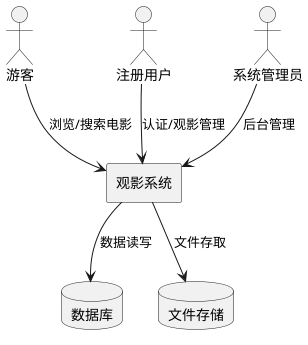
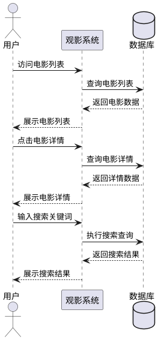
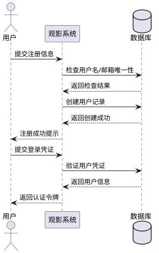
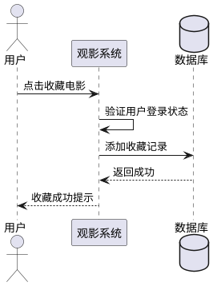
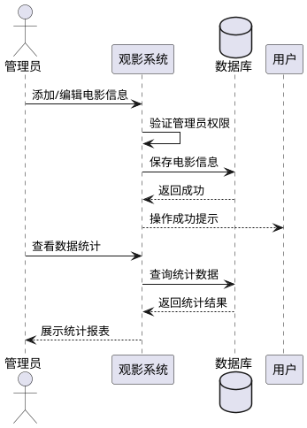

# 观影系统需求规格文档

## 1. 组件定位

### 1.1 核心职责

本组件负责提供电影信息浏览、用户观影管理和后台运营管理的综合服务，实现用户便捷观影决策和系统高效运营的核心价值。

### 1.2 核心输入

1. **用户浏览请求**：来自用户的电影列表查询、详情查看、搜索筛选等操作
2. **用户认证请求**：来自用户的注册、登录、个人信息修改等操作
3. **观影管理请求**：来自用户的收藏、观影记录管理等操作
4. **后台管理请求**：来自管理员的电影信息管理、用户管理、数据统计等操作

### 1.3 核心输出

1. **电影信息响应**：返回给用户的电影列表、详情、搜索结果等数据
2. **用户状态响应**：返回给用户的认证状态、个人信息、操作结果等
3. **观影数据响应**：返回给用户的收藏列表、观影历史等
4. **管理统计响应**：返回给管理员的数据报表、系统状态、操作结果等

### 1.4 职责边界

本组件不负责：
- 视频内容的实际存储和流媒体传输
- 支付交易处理（如在线购票）
- 第三方社交平台集成
- 复杂的推荐算法引擎（仅提供基础筛选功能）

## 2. 领域术语

**电影**
: 系统中展示的影视作品信息实体，包含标题、海报、简介、分类、评分等属性。

**用户**
: 系统的注册使用者，具有唯一标识和个人观影相关数据。

**收藏**
: 用户标记感兴趣的电影，便于后续查看的行为记录。

**观影记录**
: 用户观看电影的历史轨迹，包含观看时间和进度信息。

**分类**
: 电影的类型标签，如动作、喜剧、科幻等。

## 3. 角色与边界

### 3.1 核心角色

- **游客**：未登录用户，可浏览和搜索电影信息
- **注册用户**：已登录用户，可使用收藏、观影记录等完整功能
- **系统管理员**：具有后台管理权限的用户，可管理电影信息和用户数据

### 3.2 外部系统

- **数据库系统**：存储电影、用户、观影相关数据
- **文件存储系统**：存储电影海报、用户头像等文件资源

### 3.3 交互上下文

## 4. DFX约束

### 4.1 性能

- 电影列表页面加载时间不超过2秒
- 电影详情页面加载时间不超过1.5秒
- 搜索请求响应时间不超过1秒
- 系统支持至少100并发用户访问

### 4.2 可靠性

- 系统可用性目标：99%
- 数据库操作失败后应自动重试3次
- 用户操作数据应实时持久化，不丢失

### 4.3 安全性

- 用户密码必须加密存储
- 所有用户操作需进行身份验证
- 管理员操作需进行权限校验
- 敏感操作需记录审计日志

### 4.4 可维护性

- 系统需提供健康检查接口
- 关键操作需记录详细日志
- 错误信息需包含可追踪的错误码

### 4.5 兼容性

- 支持主流浏览器（Chrome、Firefox、Edge、Safari）
- 响应式设计，支持移动端访问
- API接口需保持向后兼容

## 5. 核心能力

### 5.1 电影浏览与搜索

#### 5.1.1 业务规则

1. **电影列表展示规则**：系统必须按指定排序方式展示电影列表，默认按更新时间倒序排列
   - 验收条件：[用户访问电影列表页] → [系统返回按更新时间倒序的电影列表]

2. **电影详情展示规则**：系统必须展示电影的完整信息，包括标题、海报、简介、分类、评分、上映时间等
   - 验收条件：[用户点击电影卡片] → [系统展示该电影的所有详细信息]

3. **搜索功能规则**：系统必须支持按电影名称进行模糊搜索，返回匹配结果
   - 验收条件：[用户输入搜索关键词] → [系统返回包含该关键词的电影列表]

4. **分类筛选规则**：系统必须支持按电影分类进行筛选，可多选分类
   - 验收条件：[用户选择分类标签] → [系统返回该分类下的电影列表]

5. **禁止项**：禁止展示已下架的电影信息
   - 验收条件：[电影状态为下架] → [该电影不出现在任何列表中]

#### 5.1.2 交互流程

#### 5.1.3 异常场景

1. **数据库查询失败**
   - 触发条件：数据库连接异常或查询超时
   - 系统行为：记录错误日志，返回缓存数据或空列表
   - 用户感知：提示"系统繁忙，请稍后重试"

2. **搜索关键词为空**
   - 触发条件：用户提交空搜索关键词
   - 系统行为：忽略搜索，返回完整电影列表
   - 用户感知：展示所有电影

3. **电影详情不存在**
   - 触发条件：请求的电影ID在数据库中不存在
   - 系统行为：返回404错误
   - 用户感知：提示"电影不存在或已下架"

### 5.2 用户管理

#### 5.2.1 业务规则

1. **用户注册规则**：用户必须提供有效的用户名、邮箱和密码才能注册，用户名和邮箱必须唯一
   - 验收条件：[用户提交有效注册信息] → [系统创建新用户账号并返回成功]

2. **用户登录规则**：用户必须提供正确的用户名/邮箱和密码才能登录，登录后获得认证令牌
   - 验收条件：[用户提交正确凭证] → [系统返回认证令牌并记录登录状态]

3. **个人信息修改规则**：用户可以修改昵称、头像等个人信息，但不能修改用户名
   - 验收条件：[用户提交个人信息修改] → [系统更新用户信息并返回成功]

4. **禁止项**：禁止使用已注册的用户名或邮箱注册新账号
   - 验收条件：[用户提交已存在的用户名或邮箱] → [系统拒绝注册并提示已被使用]

#### 5.2.2 交互流程

#### 5.2.3 异常场景

1. **用户名或邮箱已存在**
   - 触发条件：注册时用户名或邮箱已被其他用户使用
   - 系统行为：拒绝注册请求
   - 用户感知：提示"用户名或邮箱已被使用"

2. **登录凭证错误**
   - 触发条件：用户名或密码不正确
   - 系统行为：拒绝登录请求
   - 用户感知：提示"用户名或密码错误"

3. **认证令牌过期**
   - 触发条件：用户令牌超过有效期
   - 系统行为：清除登录状态
   - 用户感知：提示"登录已过期，请重新登录"

### 5.3 观影管理

#### 5.3.1 业务规则

1. **收藏功能规则**：用户可以将感兴趣的电影添加到收藏列表，同一电影不能重复收藏
   - 验收条件：[用户点击收藏按钮] → [系统将电影添加到用户收藏列表]

2. **取消收藏规则**：用户可以从收藏列表中移除电影
   - 验收条件：[用户点击取消收藏] → [系统从收藏列表中移除该电影]

3. **观影记录规则**：系统必须自动记录用户的观影行为，包括观看时间和进度
   - 验收条件：[用户观看电影] → [系统自动创建或更新观影记录]

4. **禁止项**：禁止未登录用户使用收藏功能
   - 验收条件：[未登录用户尝试收藏] → [系统提示需要登录]

#### 5.3.2 交互流程

#### 5.3.3 异常场景

1. **重复收藏**
   - 触发条件：用户尝试收藏已在收藏列表中的电影
   - 系统行为：忽略操作
   - 用户感知：提示"已收藏该电影"

2. **未登录操作**
   - 触发条件：未登录用户尝试收藏
   - 系统行为：拒绝操作
   - 用户感知：提示"请先登录"

### 5.4 后台管理

#### 5.4.1 业务规则

1. **电影信息管理规则**：管理员可以添加、编辑、删除电影信息，删除操作为逻辑删除（下架）
   - 验收条件：[管理员提交电影信息修改] → [系统更新电影信息并记录操作日志]

2. **用户管理规则**：管理员可以查看用户列表、禁用/启用用户账号
   - 验收条件：[管理员禁用用户] → [该用户无法登录系统]

3. **数据统计规则**：系统必须提供观影数据统计功能，包括电影观看次数、用户活跃度等
   - 验收条件：[管理员访问统计页面] → [系统展示数据统计报表]

4. **禁止项**：禁止管理员修改其他管理员的权限
   - 验收条件：[管理员尝试修改其他管理员权限] → [系统拒绝操作]

#### 5.4.2 交互流程

#### 5.4.3 异常场景

1. **权限不足**
   - 触发条件：普通用户尝试访问管理功能
   - 系统行为：拒绝访问
   - 用户感知：提示"权限不足"

2. **电影信息不完整**
   - 触发条件：管理员提交的电影信息缺少必填字段
   - 系统行为：拒绝保存
   - 用户感知：提示"请填写完整的电影信息"

## 6. 数据约束

### 6.1 电影

1. **电影ID**：唯一标识，系统自动生成，不可修改
2. **标题**：必填，长度1-100字符
3. **海报**：图片URL，必填
4. **简介**：必填，长度10-1000字符
5. **分类**：必填，从预定义分类列表中选择
6. **评分**：系统计算的平均评分，范围0-5，保留1位小数
7. **上映时间**：日期格式，可选
8. **状态**：枚举值（上架/下架），默认为上架

### 6.2 用户

1. **用户ID**：唯一标识，系统自动生成，不可修改
2. **用户名**：唯一，必填，长度3-20字符，仅支持字母、数字、下划线
3. **邮箱**：唯一，必填，符合邮箱格式
4. **密码**：必填，长度6-20字符，加密存储
5. **昵称**：可选，长度1-30字符
6. **头像**：图片URL，可选
7. **角色**：枚举值（普通用户/管理员），默认为普通用户
8. **状态**：枚举值（正常/禁用），默认为正常
9. **注册时间**：系统自动生成

### 6.3 收藏

1. **收藏ID**：唯一标识，系统自动生成
2. **用户ID**：关联用户，必填
3. **电影ID**：关联电影，必填
4. **收藏时间**：系统自动生成
5. **唯一约束**：同一用户不能重复收藏同一电影

### 6.4 观影记录

1. **记录ID**：唯一标识，系统自动生成
2. **用户ID**：关联用户，必填
3. **电影ID**：关联电影，必填
4. **观看时间**：系统自动生成
5. **观看进度**：百分比，范围0-100
6. **最后观看时间**：系统自动更新
